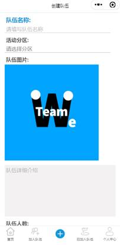

# README

## 1.简介

WeTeam是基于微信小程序开发的一款组队小程序，可以满足大学生比赛项目的组队需求。

高校组队系统，在高校，学生经常会因为某种活动（如郊游、打球、参加竞赛等）而进行全校性的临时组队，为了便于学生进行组队活动，计划开发一款组队小程序。

### **1.1** **作品创意/项目背景**

大学生的活动丰富多彩，很多活动都是需要以团队的形式开展进行。但是目前大学生的组队方式较为贫瘠，大多数组队都是在熟人中进行，但是认识到的熟人也都是和自己同一个专业领域的，并且在熟人中不一定和你一样有时间经历和意愿想参加这个活动，要想组建一个较为全面的队伍较为困难，抓住这个痛点可以进行该项目的进行。

我们根据这个需求，考虑学习和开发的是微信小程序，小程序的英文名Wechat Mini Program，是一种不需要下载安装即可使用的应用，它实现了应用“触手可及”的梦想，用户扫一扫或搜一下即可打开应用。全面开放申请后，主体类型为企业、政府、媒体、其他组织或个人的开发者，均可申请注册小程序。学习入门成本不大，并且考虑到我们这么项目的规模来说，小程序就很合适。

微信小程序是一种不用下载就能使用的应用，也是一项创新，经过将近两年的发展，已经构造了新的微信小程序开发环境和开发者生态。微信小程序也是这么多年来中国IT行业里一个真正能够影响到普通程序员的创新成果，已经有超过150万的开发者加入到了微信小程序的开发，与我们一起共同发力推动微信小程序的发展，微信小程序应用数量超过了一百万，覆盖200多个细分的行业，日活用户达到两个亿，微信小程序还在许多城市实现了支持地铁、公交服务。微信小程序发展带来更多的就业机会，2017年小程序带动就业104万人，社会效应不断提升。

### 1.2 项目实施计划

我们学习和运用了软件工程的基础知识，实践设计了这款小程序。

采用小程序的方式进行该项目的实现，首先我们进行相关技术知识的理论学习，进行开发前期的知识储备。

然后我们制定相关的项目计划，计划各个开发阶段的开始时间和截止时间，项目启动。

进行需求分析，确定我们即将要实现的功能，完成需求规格说明书。

进入软件设计，将软件需求设计成一个个可以实现的功能模块，完成设计规格说明书。

然后进行程序代码编程阶段，小组两个成员进行合理分工，按功能模块页面和前后端分离来分工。编写完成后，进行软件测试阶段。

发布上线，运行维护。

## 2 总体设计

### 2.1 系统功能 

系统实现的页面有首页推荐队伍、加入队伍、创建队伍，管理已加入队伍、查看个人中心和个人信息、登录注册等页面。

 

#### 2.1.1 功能概述.

- WeTeam首页：广告轮播图、热门队伍推荐功能、查看队伍详情、查看更多队伍
- 加入队伍：查看队伍列表、查看队伍详情、加入队伍功能、队伍的分类显示、队伍的模糊查找功能
- 创建队伍：队伍各信息输入、发布组队功能
- 已加入的队伍：查看自己已加入队伍列表、退出队伍
- 个人中心页面：编辑自己的详细信息、消息中心查看自己的消息、查看自己发起的队伍、更多选项、关于我们、意见反馈、退出登录、在线客服
- 登录/注册：登录/或注册WeTeam账号

 

## 2.1.2 功能说明

1. WeTeam首页

首页的第一栏就是搜索想要的队伍，可以尽情的搜索用户感兴趣的队伍，下面是一个广告栏，可以放置投资方的广告，再下面有一些符合用户喜好的优质热门队伍的推荐

 

2. 加入队伍

加入队伍页面有需要的队伍信息可供选择，我们对每个队伍的信息进行分类，运用了小程序的云函数开发，查询出符合条件的队伍，筛选出符合条件的队伍列表。可以点击查看每个队伍的具体详细信息，并且选择是否加入该队伍。

 

3. 创建队伍

创建队伍的信息有：队伍名称、活动分区、队伍图片、队伍人数、活动高校、活动地区、动开始时间、活动结束时间，填写相应的队伍信息是必要的，这样有利于队伍找到志同道合伙伴组队。

 

 

4. 已加入的队伍

可以看到自己加入的队伍的信息，根据之前自己组队的队伍信息，也可以对自己的队伍进行管理，可以模糊搜索出你想要找的已加入的队伍，可以退出自己所加入的队伍也可以解散自己所创建的队伍。

 

5. 个人中心页面

6. 个人中心可以编辑自己的详细信息

7. 有消息中心查看自己的消息

8. 关于我们

9. 意见反馈

10. 还有更多选项，在线客服

 

11. 登录/注册

 

 

## 3 系统详细设计说明

### 3.1 系统软硬件平台

硬件：移动端（手机、iPad），电脑PC

软件：微信小程序

### 3.2 系统开发平台

微信开发者平台

### 3.3 系统运行平台

Android端和ios端、PC端都可使用，需安装微信app

 

## 4 数据库

## 5 源代码清单

目录结构：

- Cloud -> 云函数
- Compoents -> 自定义组件
- Icons -> 图片资源
- Pages -> 页面代码

 

 

 

 

 

 

 